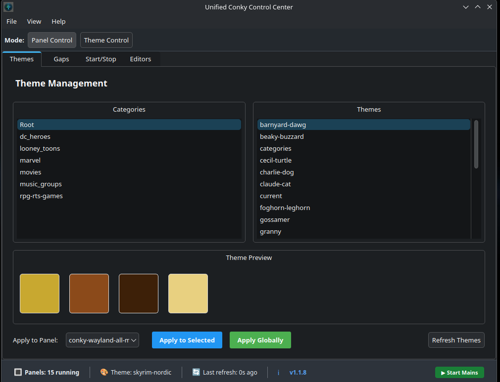
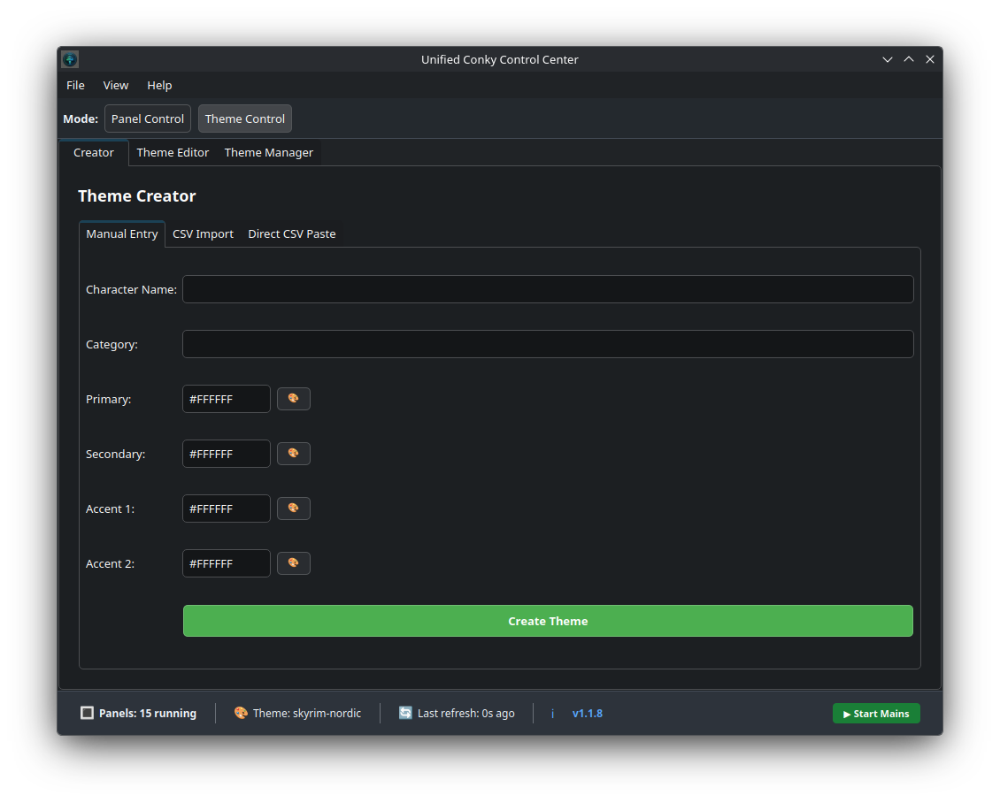
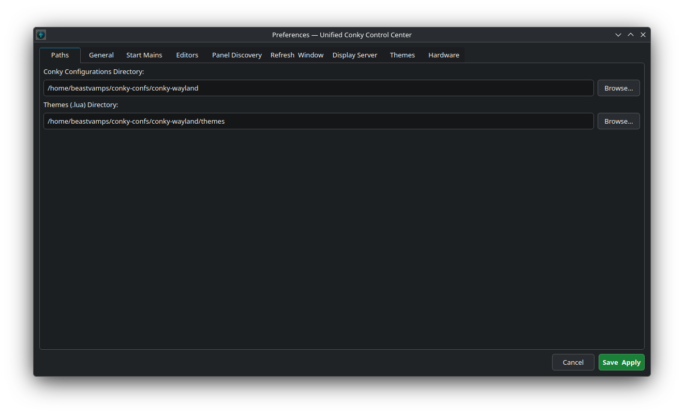
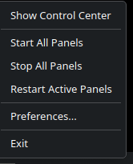

# Unified Conky Control Center (UCCC)

[](https://www.gnu.org/licenses/gpl-3.0)
[](https://github.com/vamps-goes-coding/UnifiedConkyControlCenter/releases)

Works on **any Linux distro** - Works on **X11 + Wayland** - Works on **every desktop environment**

**Stop wrestling with `.conf` files.** UCCC is a simple visual hub for managing all your Conky panels. Built for everyone who loves customizing their desktop, without the headache.

[**Download Releases**](https://github.com/vamps-goes-coding/UnifiedConkyControlCenter/releases) | [**Report Issues**](https://github.com/vamps-goes-coding/UnifiedConkyControlCenter/issues)

---

## Screenshots

### Main Window


### Theme Control


### Preferences


### System Tray Menu


---

## What it does

- Automatically finds all your existing Conky panels
- One click to start / stop / restart any panel
- Theme switcher without editing code
- Works silently in your system tray
- No complicated setup required
- Works exactly the same everywhere

---

## Requirements

| Dependency | Purpose |
|-----------|---------|
| Qt6 >= 6.4 | GUI framework |
| CMake >= 3.21 | Build system |
| Conky | The thing this manages |
| nlohmann_json | Config file handling (auto-fetched if missing) |

---

## Install

### Arch Linux (AUR)

```bash
yay -S unified-conky-control-center
```

Or build from the PKGBUILD:

```bash
git clone https://github.com/vamps-goes-coding/UnifiedConkyControlCenter.git
cd UnifiedConkyControlCenter
makepkg -si
```

### Debian / Ubuntu

Download the `.deb` from [Releases](https://github.com/vamps-goes-coding/UnifiedConkyControlCenter/releases) and install:

```bash
sudo dpkg -i UnifiedConkyControlCenter-*.deb
sudo apt-get install -f
```

### Fedora / RPM-based

Download the `.rpm` from [Releases](https://github.com/vamps-goes-coding/UnifiedConkyControlCenter/releases) and install:

```bash
sudo rpm -i UnifiedConkyControlCenter-*.rpm
```

### Universal Installer

```bash
curl -s https://raw.githubusercontent.com/vamps-goes-coding/UnifiedConkyControlCenter/main/install.sh | bash
```

---

## Building from Source

```bash
git clone https://github.com/vamps-goes-coding/UnifiedConkyControlCenter.git
cd UnifiedConkyControlCenter
mkdir build && cd build
cmake ..
make -j$(nproc)
sudo make install
```

---

## How to Use

1. Quick and easy setup from the Smart Installer (install.sh)
2. Launch it from your applications menu
3. All your Conkys will show up automatically
4. Click the buttons to control them
5. Right click the tray icon for quick actions

You don't need to configure anything. It just works.

---

## Supported Environments

Gnome, KDE, Xfce, Cinnamon, MATE, LXQt, i3, Sway, Hyprland, Openbox, Awesome, BSPWM, and everything else that runs Linux.

---

## Contributing

Contributions are welcome! If you find a bug or want to add a feature:

1. Fork the repo
2. Create a branch (`git checkout -b my-feature`)
3. Commit your changes
4. Open a Pull Request

---

## Support

If you run into issues or have questions, [open an issue](https://github.com/vamps-goes-coding/UnifiedConkyControlCenter/issues) on GitHub.

---

## License

This project is licensed under the GNU General Public License v3.0 - see the [LICENSE](LICENSE) file for details.

---

Thank you for checking out this tool. I hope it helps you as it has me.
